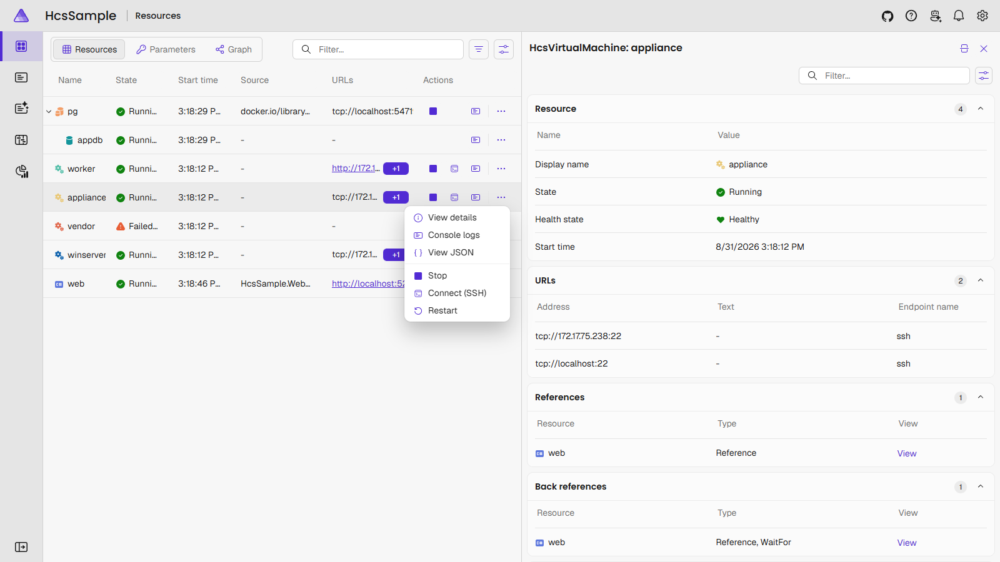
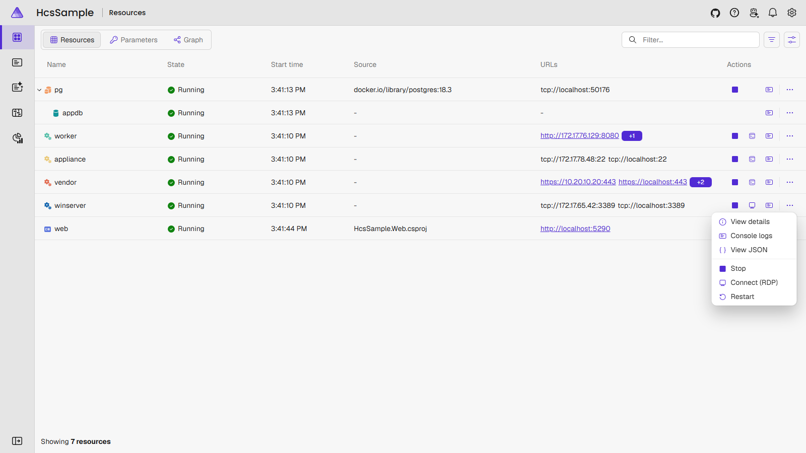
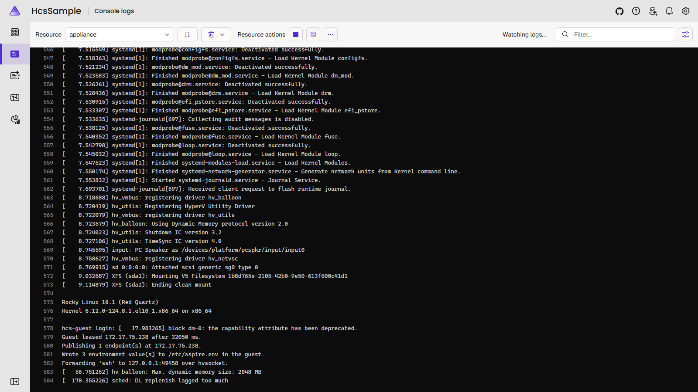

# Connect (SSH) and Connect (RDP)

`WithSshCommand` and `WithRdpCommand` add Connect commands to a VM's dashboard
actions menu: Connect (SSH) opens a terminal session, Connect (RDP) opens mstsc, with
the address and account already supplied. `WithShellCommand` is the container
equivalent — Connect (Shell) opens an interactive console inside the container via
`hcsctl container exec --interactive --tty`.





## Two addresses

A VM with the [hcsguest agent](../hcsctl/guest-agent.html) has two addresses:

- **The leased address** — the guest's DHCP address, reported by the agent. Endpoints,
  health checks, and `WithReference` all use it: it is a real network address that
  other resources can reach.
- **An hvsocket forward** — at boot, once `hcsctl guest info` confirms the agent is
  reachable, AspireHcs starts `hcsctl guest forward`, publishing the guest port on a
  host loopback port. The relay is a Hyper-V socket; the guest's NIC, DHCP lease and
  firewall are not involved.

The Connect commands prefer the forward and fall back to the leased address when there
is no agent (agentless appliances declared with `WithGuestAddress`) or the forward has
stopped. The appliance's console log shows the sequence:

```
Guest leased 172.17.75.238 after 32050 ms.
Publishing 1 endpoint(s) at 172.17.75.238.
Wrote 3 environment value(s) to /etc/aspire.env in the guest.
Forwarding 'ssh' to 127.0.0.1:49458 over hvsocket.
```



## Why the forward is preferred

The forward works when the guest's network does not: NIC disabled, firewall
misconfigured, DHCP broken. An RDP session over the forward stayed up after the
guest's NIC was disabled, and the NIC was re-enabled from that session.

## Why WithReference does not use it

The forward is a host-loopback address, reachable only from the AppHost's machine. A
connection string pointing at it is unreachable from any consumer running in a guest
or container. `WithReference` therefore uses the leased address; only the Connect
commands use the forward.
