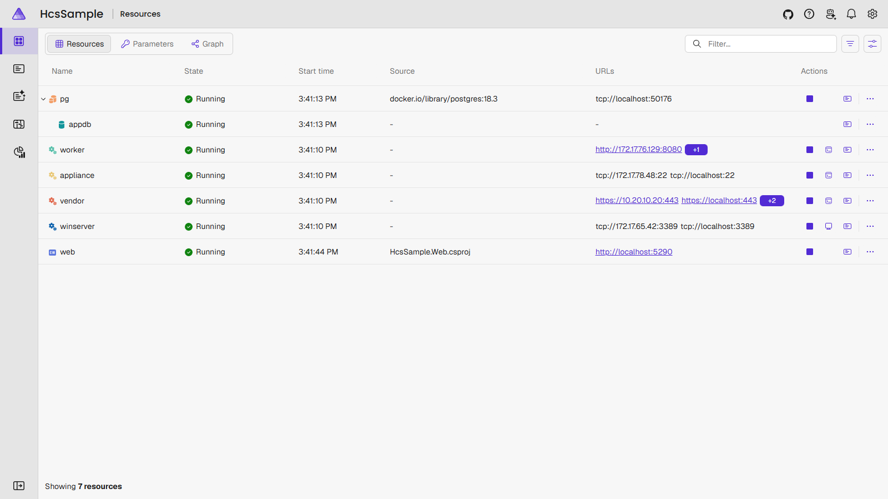
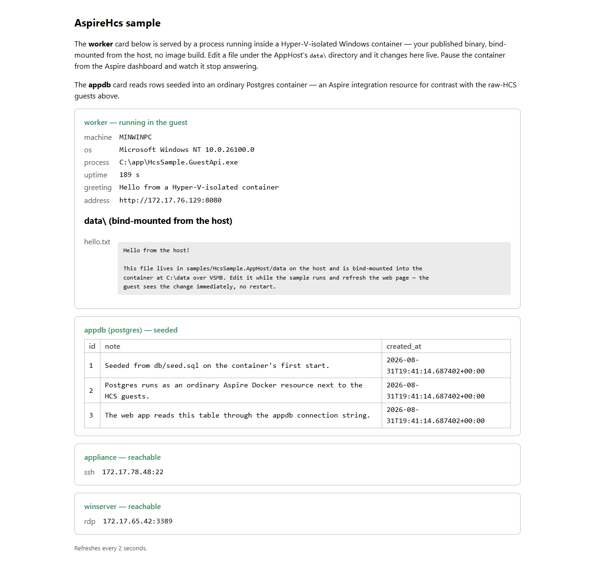
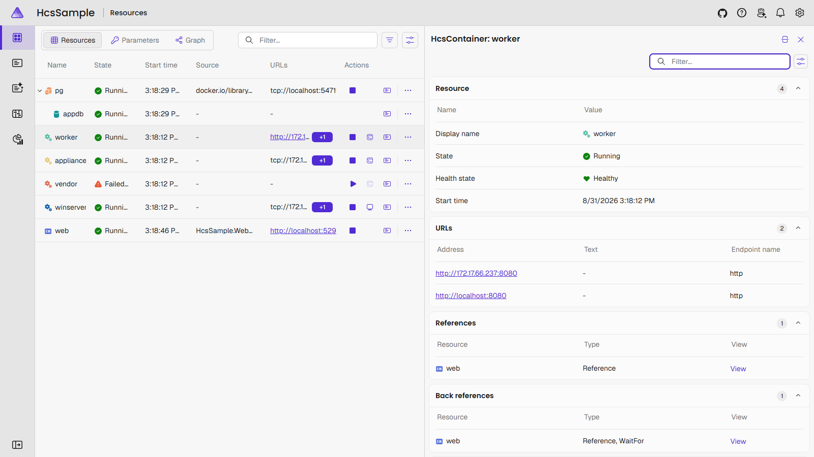

# Running the sample with everything enabled

[HcsSample.AppHost](https://github.com/joshmakestuff/AspireHcs/blob/main/samples/HcsSample.AppHost/README.md)
runs with zero configuration as a container + web frontend + Postgres. Everything else
is opt-in, keyed on configuration being present. Fully enabled, one `aspire run` boots
six resources:

- **worker** — a Hyper-V-isolated nanoserver container running a .NET binary
  bind-mounted from the host. No Dockerfile, no image build.
- **web** — an ordinary Aspire project consuming every guest's endpoints.
- **pg** — an ordinary Aspire Postgres container (Linux, Docker), seeded from `db\`.
- **appliance** — a Linux VM with a Connect (SSH) button.
- **winserver** — a Windows VM with a Connect (RDP) button.
- **vendor** — an agentless appliance VM: no guest agent, a fixed in-guest address,
  optional data disk, pinned MAC and VLAN.

Plus **ConsumeWeb**: the container and the Linux VM consume `web`'s endpoint back —
delivered into the container through a Docker relay, and into the VM over hvsocket.

## Prerequisites

- Windows with Hyper-V; run the AppHost elevated or as a member of Hyper-V
  Administrators.
- .NET SDK and Aspire.
- Docker — for **pg** and for the **ConsumeWeb** relay.
- Two prepared VHDX images with the hcsguest agent (Linux and Windows), and an
  appliance's boot VHDX with a known fixed address. Image requirements and build steps
  are in the
  [sample README](https://github.com/joshmakestuff/AspireHcs/blob/main/samples/HcsSample.AppHost/README.md#preparing-a-vm-image).

## One-time preparation

```powershell
.\samples\prepare.ps1    # publishes the guest app, pins hcsctl, imports the image (elevated once)
```

After this, no PATH entry or environment variable is needed: the AppHost falls back to
the pinned `tools\hcsctl` and the store beside the sample.

## Configuration

Everything opt-in lives in the `Hcs` section of `appsettings.json` (or user secrets),
each with an environment-variable fallback — the full table is in the README. All
switches on:

```json
{
  "Hcs": {
    "ConsumeWeb": "1",

    "LinuxVhdx": "D:\\images\\rocky-10.vhdx",
    "LinuxUser": "root",

    "WindowsVhdx": "D:\\images\\winserver-2025.vhdx",
    "WindowsUser": "Administrator",

    "ApplianceVhdx": "D:\\appliance\\os.vhdx",
    "ApplianceAddress": "192.168.1.50",
    "ApplianceDataVhdx": "D:\\appliance\\data.vhdx",
    "ApplianceNetwork": "Default Switch",
    "ApplianceMac": "00-15-5D-02-33-0E",
    "ApplianceVlan": "20",
    "ApplianceHealthPath": "/",
    "ApplianceSshUser": "root"
  }
}
```

Each VM section is independent — omit one and its resource simply doesn't exist.
`ApplianceAddress` is required with `ApplianceVhdx`; the data disk, MAC and VLAN are
themselves optional. VHDX files are booted as copy-on-write children, so the originals
are never written and can back several runs at once.

## Run

```powershell
cd samples\HcsSample.AppHost
aspire run
```

The VMs gate on real readiness: the agented VMs wait for the DHCP lease reported by
hcsguest, the appliance for its fixed address answering its health check. `web` waits
for all of them.



Each VM row shows two URLs: the guest's leased address and a `localhost` port on the
host. The [Connect commands page](connect.html) explains the second one.

## What to look at

- Edit `data\hello.txt` while it runs — the container serves the change on the next
  refresh, live over VSMB.
- Pause and resume **worker** from the dashboard; its details show guest stats and
  processes. Connect (Shell) opens a cmd.exe inside it.
- Connect (SSH) on **appliance** and **vendor**, Connect (RDP) on **winserver**.
- With ConsumeWeb on, the container and Linux VM receive `WEB_URL` — in the VM it lands
  in `/etc/aspire.env`.




